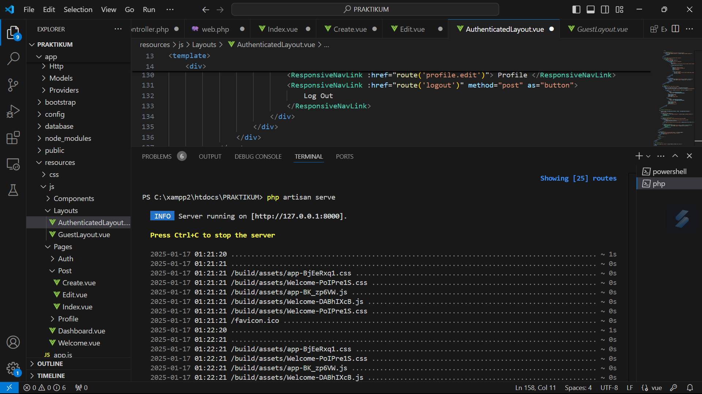
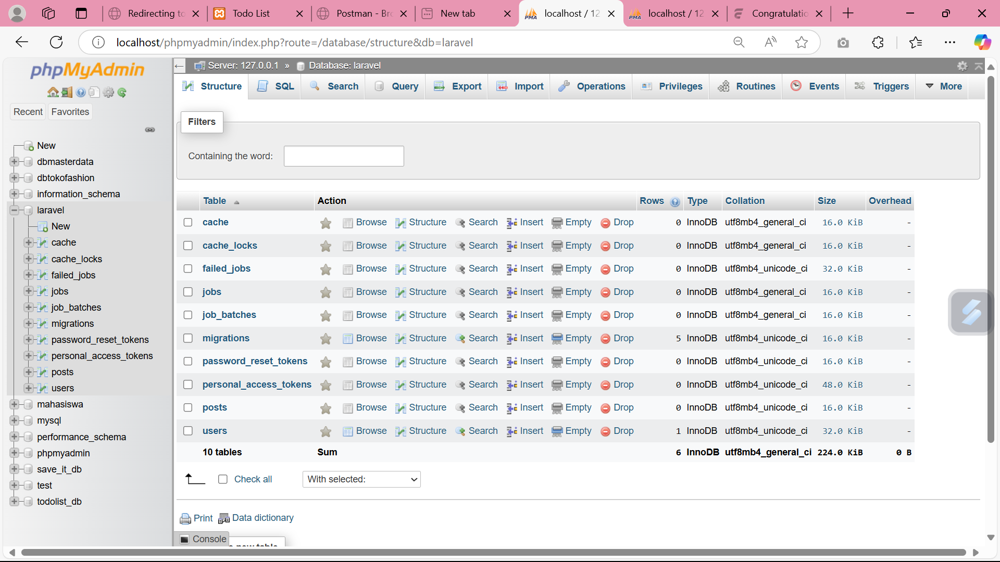

# PRAKTIKUM FRAMEWORK 

### Testing

### Database

## Penjelasan Kode

### Model `Post`

Model `Post` berada di dalam folder `App\Models` dan digunakan untuk berinteraksi dengan tabel `posts` di database. Berikut adalah penjelasan mengenai kode di dalam model ini:

1. **Namespace dan Impor**:
   - Model ini menggunakan namespace `App\Models`, yang merupakan lokasi default untuk model di Laravel.
   - `use Illuminate\Database\Eloquent\Factories\HasFactory;` mengimpor trait `HasFactory` yang memungkinkan kita untuk menggunakan factory dalam pembuatan instance model `Post`.
   - `use Illuminate\Database\Eloquent\Model;` mengimpor kelas `Model` dari Eloquent yang menyediakan semua fitur dasar untuk interaksi dengan database, seperti query builder, relasi, dan lain-lain.

2. **Trait `HasFactory`**:
   - Dengan menggunakan trait `HasFactory`, model ini bisa memanfaatkan kemampuan factory di Laravel untuk membuat instance dari model `Post` dalam pengujian atau seeding database.

3. **Properti `$fillable`**:
   - Properti `$fillable` adalah array yang menentukan kolom mana yang dapat diisi melalui mass assignment. Ini adalah cara untuk melindungi aplikasi dari serangan mass-assignment.
   - Kolom yang dapat diisi adalah:
     - `title`: Judul dari post.
     - `content`: Konten atau isi dari post.
     - `image`: Path gambar yang diunggah.
     - `country`: Negara terkait post.
     - `phone`: Nomor telepon terkait post.
     - `description`: Deskripsi tambahan terkait post.

   Dengan menggunakan `$fillable`, kita dapat menghindari perubahan data yang tidak diinginkan di kolom yang tidak disebutkan dalam array ini.

4. **Fungsi `Post`**:
   - Model ini mewakili tabel `posts` dan dapat digunakan untuk melakukan operasi CRUD (Create, Read, Update, Delete) pada data di dalam tabel tersebut.

### Migrasi Database

Terdapat file migrasi yang digunakan untuk membuat dan memodifikasi tabel `posts` di database. Berikut adalah penjelasan terkait migrasi tersebut:

1. **Membuat Tabel `posts`**:
   - Pada metode `up()`, migrasi pertama-tama membuat tabel `posts` dengan kolom berikut:
     - `id`: Kolom ID yang otomatis terincrement.
     - `title`: Kolom untuk menyimpan judul postingan.
     - `body`: Kolom untuk menyimpan konten body (opsional dan nullable).
     - `timestamps`: Kolom `created_at` dan `updated_at` yang otomatis di-manage oleh Laravel.

2. **Menambah Kolom Baru pada Tabel `posts`**:
   - Setelah tabel `posts` dibuat, migrasi akan menambahkan beberapa kolom baru:
     - `content`: Kolom ini untuk menyimpan konten utama postingan yang lebih panjang.
     - `image`: Kolom untuk menyimpan path atau URL gambar yang terkait dengan postingan.
     - `country`: Kolom untuk menyimpan negara asal postingan.
     - `phone`: Kolom untuk menyimpan nomor telepon terkait postingan.
     - `description`: Kolom opsional untuk menyimpan deskripsi postingan.
     - `body`: Kolom ini diperbarui menjadi memiliki nilai default kosong (default '') jika belum diisi.

3. **Mengubah Kolom `body`**:
   - Kolom `body` yang awalnya nullable akan diubah untuk memiliki nilai default kosong (`''`) jika tidak ada nilai yang diberikan.

4. **Rollback/Menghapus Kolom dan Tabel**:
   - Pada metode `down()`, migrasi menghapus kolom-kolom yang ditambahkan (`content`, `image`, `country`, `phone`, `description`) dan menghapus tabel `posts`. Ini berguna jika ingin membatalkan migrasi dan mengembalikan database ke keadaan semula.

### Validasi

Di dalam controller `PostController`, terdapat aturan validasi untuk form input. Aturan tersebut meliputi:

- `title`: Wajib diisi, berupa string, dan maksimal 255 karakter.
- `content`: Wajib diisi, berupa string.
- `country`: Wajib diisi, berupa string, dan maksimal 100 karakter.
- `phone`: Wajib diisi, berupa string yang sesuai dengan format nomor telepon internasional.
- `description`: Opsional, berupa string dengan panjang maksimal 500 karakter.
- `image`: Opsional, berupa gambar dengan format yang diperbolehkan (jpeg, png, jpg, gif) dan maksimal ukuran 2MB.

### CRUD (Create, Read, Update, Delete)

- **Membuat Post Baru**: 
  - Menggunakan metode `store()` untuk membuat post baru. Jika ada gambar yang di-upload, gambar tersebut disimpan di folder `posts` dalam disk `public`.

- **Menampilkan Daftar Postingan**: 
  - Metode `index()` menampilkan semua postingan yang ada dalam urutan terbaru. Gambar yang ada pada setiap postingan akan diubah menjadi URL yang bisa digunakan oleh frontend.

- **Mengedit Postingan**: 
  - Metode `edit()` menampilkan form untuk mengedit postingan. Jika ada gambar yang terhubung dengan postingan, maka URL gambar tersebut akan ditampilkan.

- **Memperbarui Postingan**: 
  - Metode `update()` memperbarui postingan dengan validasi yang sama seperti saat membuat post. Jika ada gambar yang baru di-upload, gambar lama akan dihapus.

- **Menghapus Postingan**: 
  - Metode `destroy()` menghapus postingan dari database dan menghapus gambar yang terkait (jika ada) dari storage.

### Penghapusan Gambar

Pada setiap proses update dan destroy, jika ada gambar yang terkait dengan postingan, gambar tersebut akan dihapus dari storage menggunakan metode `deleteImageIfExists()`.

### Penanganan Error

Di setiap metode yang berhubungan dengan database dan file, jika terjadi kesalahan, pesan error akan dicatat ke log dan dikembalikan ke pengguna dengan pesan yang sesuai.

## Struktur Direktori

- **app/Http/Controllers/PostController.php**: Kontroler utama untuk menangani CRUD postingan.
- **app/Models/Post.php**: Model yang mewakili tabel `posts` di database dan berfungsi untuk operasi CRUD.
- **resources/js/Pages/Post/Index.vue**: Komponen frontend untuk menampilkan daftar postingan.
- **resources/js/Pages/Post/Create.vue**: Komponen frontend untuk membuat postingan baru.
- **resources/js/Pages/Post/Edit.vue**: Komponen frontend untuk mengedit postingan yang ada.
- **storage/app/public/posts**: Direktori penyimpanan untuk gambar postingan.

## Pengujian

Aplikasi ini menggunakan PHPUnit untuk menguji berbagai fitur yang ada, termasuk pengujian untuk controller `PostController`. Pengujian ini bertujuan untuk memastikan bahwa semua operasi CRUD (Create, Read, Update, Delete) berjalan dengan benar. Berikut adalah penjelasan tentang pengujian yang ada dalam file `PostControllerTest.php`:

### 1. **Pengujian Menampilkan Halaman Index Postingan**
   - **Metode**: `it_displays_the_post_index_page()`
   - Pengujian ini memeriksa apakah halaman daftar postingan (index) berhasil dimuat.
   - Pengujian ini akan memasukkan beberapa postingan ke dalam database dan memverifikasi bahwa halaman `Post/Index` ditampilkan dengan benar dan mencantumkan 3 postingan.

### 2. **Pengujian Menampilkan Formulir Pembuatan Postingan Baru**
   - **Metode**: `it_displays_the_post_creation_form()`
   - Pengujian ini memeriksa apakah halaman formulir untuk membuat postingan baru berhasil dimuat.
   - Pengujian ini memverifikasi bahwa komponen `Post/Create` ditampilkan dengan benar.

### 3. **Pengujian Membuat Postingan Baru**
   - **Metode**: `it_creates_a_new_post()`
   - Pengujian ini menguji proses pembuatan postingan baru.
   - Pada pengujian ini, gambar palsu disertakan menggunakan `UploadedFile::fake()` untuk memastikan bahwa file gambar dapat diunggah dengan benar.
   - Setelah berhasil membuat postingan, pengujian memverifikasi bahwa data postingan telah masuk ke database dan gambar yang diunggah disimpan di storage publik.

### 4. **Pengujian Menampilkan Formulir Edit Postingan**
   - **Metode**: `it_displays_the_post_edit_form()`
   - Pengujian ini memeriksa apakah formulir pengeditan postingan berhasil dimuat.
   - Pengujian ini memastikan bahwa data dari postingan yang ingin diedit dimuat dengan benar pada halaman `Post/Edit`.

### 5. **Pengujian Memperbarui Postingan**
   - **Metode**: `it_updates_an_existing_post()`
   - Pengujian ini menguji apakah postingan yang ada dapat diperbarui dengan benar.
   - Seperti pada pengujian pembuatan postingan, gambar baru juga diunggah dan disimpan di storage.
   - Setelah pembaruan berhasil, pengujian memverifikasi bahwa perubahan telah tersimpan di database dan file gambar baru disimpan.

### 6. **Pengujian Menghapus Postingan**
   - **Metode**: `it_deletes_a_post()`
   - Pengujian ini menguji proses penghapusan postingan dari database.
   - Setelah postingan dihapus, pengujian memverifikasi bahwa data postingan telah dihapus dari database dan file gambar yang terkait juga dihapus dari storage.

### Detail Pengujian
- **RefreshDatabase**: Semua pengujian menggunakan trait `RefreshDatabase`, yang memastikan database direset sebelum setiap pengujian dijalankan. Ini membantu memastikan bahwa pengujian tidak dipengaruhi oleh data dari pengujian sebelumnya.
- **Storage::fake**: Untuk pengujian yang melibatkan unggahan file, kami menggunakan `Storage::fake('public')` untuk membuat disk palsu yang memungkinkan pengujian file tanpa benar-benar menyentuh sistem file yang sesungguhnya.
- **UploadedFile::fake()**: Untuk menguji pengunggahan gambar, kami menggunakan `UploadedFile::fake()->image('filename.jpg')`, yang membuat file gambar palsu yang dapat digunakan dalam pengujian.

### Struktur Direktori Pengujian

- **tests/Feature/PostControllerTest.php**: File ini berisi pengujian untuk controller `PostController`. Setiap metode pengujian memeriksa berbagai aspek dari CRUD postingan seperti menampilkan halaman, membuat, mengedit, memperbarui, dan menghapus postingan.

## 📝 Lisensi  
&copy; 2025 Nida Shofwatunnisa.